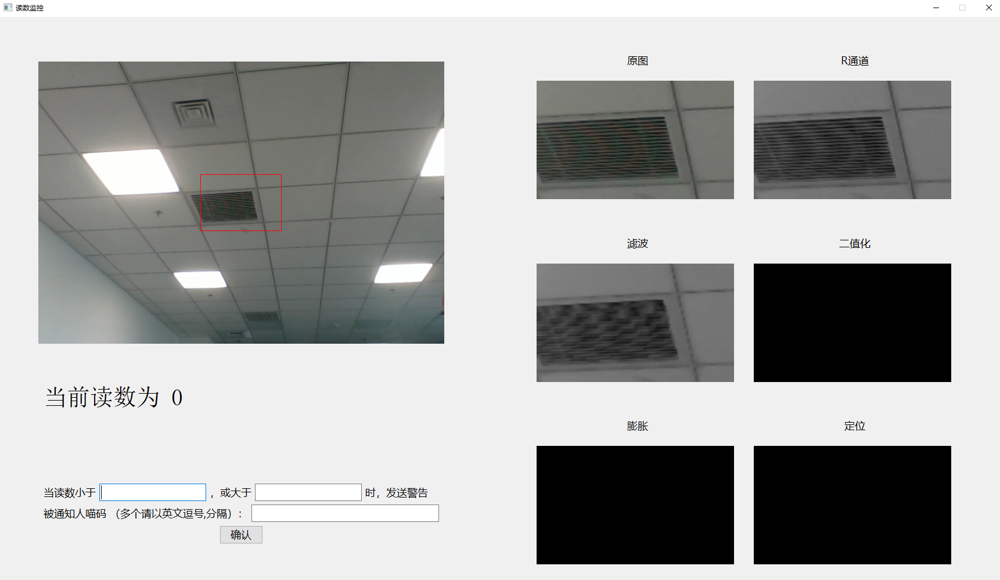

# Digit_tube_monitor
This is a digital tube indicating number surveillance system, with a GUI for interaction. When the indicating number (identified from the rectangle area specified by users) greater than the maximum value or less than the minimum value, this program will alert by miaotixing. User need to sign on and get miao code to  fill in the corresponding place.

### Development environment

- opencv-python 4.5.1.48
- numpy 1.8.15
- PyQt5 5.15.4

